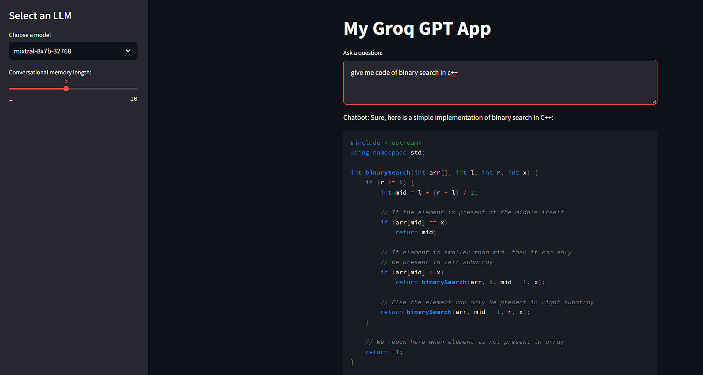

# My-Groq-GPT
This tool will help to create the new responses based on the Prompt provided by user  



you can generate the Text data from this project from 3 different type of models. 
this gpt app also provides the chat memory up to 10 memory chains.

## Implementation Steps


1. Stage 1: Download the repository
1. Stage 2: Set-up the project

## Set-up
1. To get started we first need to get an API_KEY from here: https://console.groq.com/keys. Inside `.env` update the value of `GROQ_API_KEY` with the API_KEY you created. 
2. To get started, first install the dependencies using:
    ```commandline
     pip install -r requirements.txt
    ```
3. Run the streamlit app:
   ```commandline
   streamlit run my_groq_gpt.py
   ```

